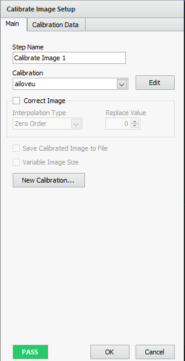
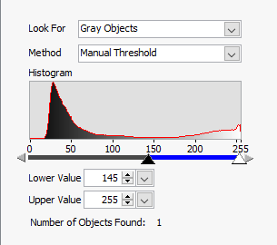

# Catch-A-Box: UR3 Robot Control System

## Project Overview

The Catch-A-Box project involves the development of an automated control system for a UR3 robotic arm to identify, track, and grasp moving boxes on a conveyor belt. The system utilizes real-time visual processing and dynamic motion planning to achieve precise, timely, and efficient object manipulation.

### System Architecture

-   **Vision System:** Utilizes a camera mounted to the end-effector of the UR3 robot to continuously monitor the conveyor belt, identify boxes, and calculate their relative positions and orientations in real-time using NI Vision Builder.
-   **Control Algorithm:** Employs a program that integrates vision system data to dynamically control the robot's arm and gripper.

## 1. Vision Builder for Automated Inspection

_Flow of the inspection_

Once the video feed is acquired, each frame is then passed to the Vision Assistant for the grayscale plane to be extracted for more efficient image processing.

_Grayscale plane extraction_

The grayscale frame is then passed to the calibration stage where the distance measurements are calibrated and the origin of the image is set to the center of the image.

_Calibration stage_

After that, the frame in then inspected to see if if finds the object of interest. Here we are using the Object Detection function to find the object.

_Object Detection function_

_Object Detection configuration_

_Object Detection result_

The function will then return the relative x-y coordinates of the images in the unit of millimeters. The coordinates are then broadcasted through TCP/IP.

In addition, an overlay displaying the real time position of the object is displayed on the video feed.

_Overlay displaying the real time position of the object_

## 2. Python Program for controlling UR3 Robot Arm

The Python program is responsible for receiving the coordinates and orientation of the object from the Vision Builder and then sending the coordinates to the UR3 robot arm to pick up the object.

Every communication in the system is done through socket programming. The Python program will establish connections with the Vision Builder Program, the UR3 robot arm and the gripper.

Here we are opting for a class-based approach programming, making the code more modular and easier to maintain.

_Class-based approach_

