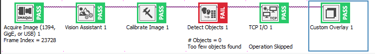

## 1. Vision Builder for Automated Inspection

_Flow of the inspection_

Once the video feed is acquired, each frame is then passed to the Vision Assistant for the grayscale plane to be extracted for more efficient image processing.

_Grayscale plane extraction_

The grayscale frame is then passed to the calibration stage where the distance measurements are calibrated and the origin of the image is set to the center of the image.

_Calibration stage_

After that, the frame in then inspected to see if if finds the object of interest. Here we are using the Match Pattern function to find the object.

_Match Pattern function_

The function will then return the relative x-y coordinates of the images in the unit of millimeters along with the orientation of the object in the unit of degrees. The coordinates are then broadcasted through TCP/IP.

_Broadcasting the coordinates and orientation_

In addition, an overlay displaying the real time position and orientation of the object is displayed on the video feed.

_Overlay displaying the real time position and orientation of the object_

## 2. Python Program for controlling UR3 Robot Arm

The Python program is responsible for receiving the coordinates and orientation of the object from the Vision Builder and then sending the coordinates to the UR3 robot arm to pick up the object.

Every communication in the system is done through socket programming. The Python program will establish connections with the Vision Builder Program, the UR3 robot arm and the gripper.

Here we are opting for a class-based approach programming, making the code more modular and easier to maintain.

_Class-based approach_

